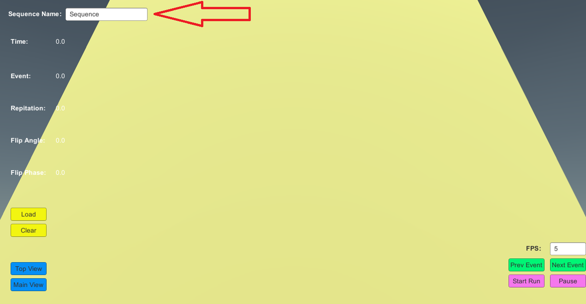
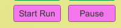

# mriSequence

# MRI Seq Visualizer 

It is the Project file of unity. you can open with unity.(test version is 2020.3 )

# MRI SeqPuls

This is build file of unity. you can directly run by **MRI Seq Visualizer.exe**


### To add more sequence

1. Add **JSON** Sequence in to Path:

```shell
..\MRI SeqPuls\MRI Seq Visualizer_Data\StreamingAssets
```

2. Then change the name in the top left to the same name as the **Json File**



### Manually Run

1. Load to load json file
2. run manually event by event 


### Automat Run

1. Set fps (Event per second), default is 5.
2. start




# 


# How to generate a Sequence Json File


## Step 1 - Put in Spin Recorder

Copy the  **SpinRecorder.py** to the Path show in below:

```shell
--Your MRIPULSEQ Git Path--\code\MRtwin\core
```


## Step 2.1 - Make some Extra class member

Add following two line in to the **Scanner.py**, you can find it in the same path as before.

```python
class Scanner:
	def set_gradient_precession_tensor_super(self,grad_moms,flips):
    	self.flipEvent = flips # add
		self.gradientEvent = grad_moms # add
```


## Step 2.2 - Initialize the Recorder

Add following two line in to the **Scanner.py**, you can find it in the same path as before

```python
 def forward(self,spins,event_time,do_dummy_scans=False,compact_grad_tensor=True):

        # ! init param
        from core.SpinRecorder import SpinRecorder # add
        recorder = SpinRecorder(self.NRep,self.T,event_time, self.flipEvent,self.gradientEvent,self.sz) # add

```


## Step 2.3 - Add Spins and print out

Add following  lines in to the **Scanner.py**, you can find it in the same path as before

```python
 def forward(self,spins,event_time,do_dummy_scans=False,compact_grad_tensor=True):
	### some code
    for r in range(self.NRep):                                   # for all repetitions
            for t in range(self.T):                                      # for all actions  
                
                ##################
                ### Magic Math ###
                ##################

                # pick up spin from high level Tensor
                spin = spins.M[:,0,:,:,0]
                # compute average M for Vox. and cover to numpy
                spinTensor = (torch.sum(spin,[0])/self.NSpins).numpy()
                recorder.addSpin(r,t,spinTensor)
	recorder.printOut()
```


## Step 3 - Check Sequence.py file

**Make sure you using** *forward & set_gradient_precession_tensor_super* **in  your sequence**. Like show in below:

```Python
scanner.init_gradient_tensor_holder()
scanner.set_gradient_precession_tensor_super(gradm_event,rf_event)  # refocusing=False for GRE/FID, adjust for higher echoes
## end S3: MR sequence definition ::: #####################################

#############################################################################
## S4: MR simulation forward process ::: #####################################
scanner.init_signal()
scanner.forward(spins, event_time)
```


## End

You should find a **Sequence.json** file in Path:

```shell
--Your MRIPULSEQ Git Path--\
```

