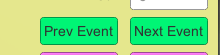

# mriSequence

# MRI Seq Visualizer 

It is the Project file of unity. you can open with unity.(test version is 2020.3 )

# MRI SeqPuls

This is build file of unity. you can directly run by **MRI Seq Visualizer.exe**


### To add more sequence

1. Add **JSON** Sequence in to Path:

```shell
..\MRI SeqPuls\MRI Seq Visualizer_Data\StreamingAssets
```

2. Then change the name in the top left to the same name as the **Json File**


### Manually Run

1. Load to load json file
2. run manually event by event 



### Automat Run

1. Set fps (Event per second), default is 5.
2. start


